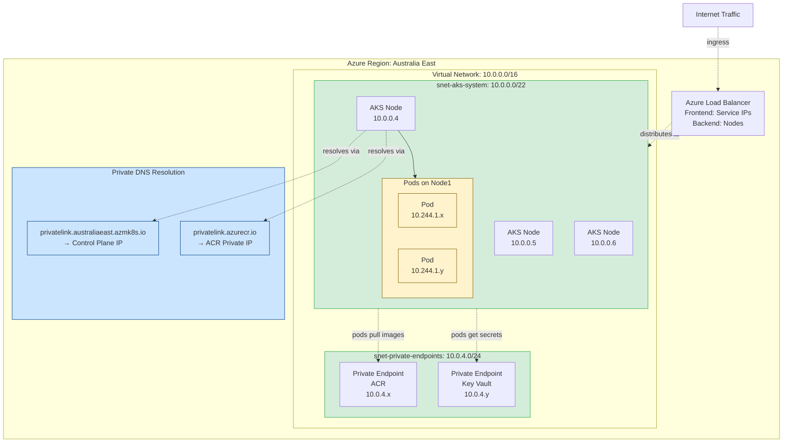
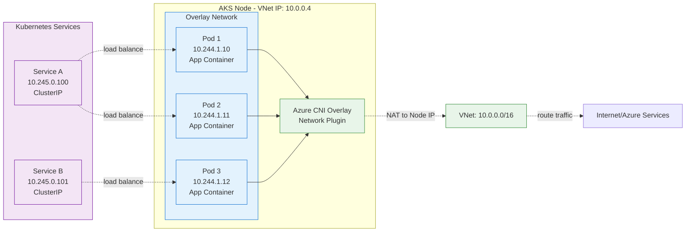
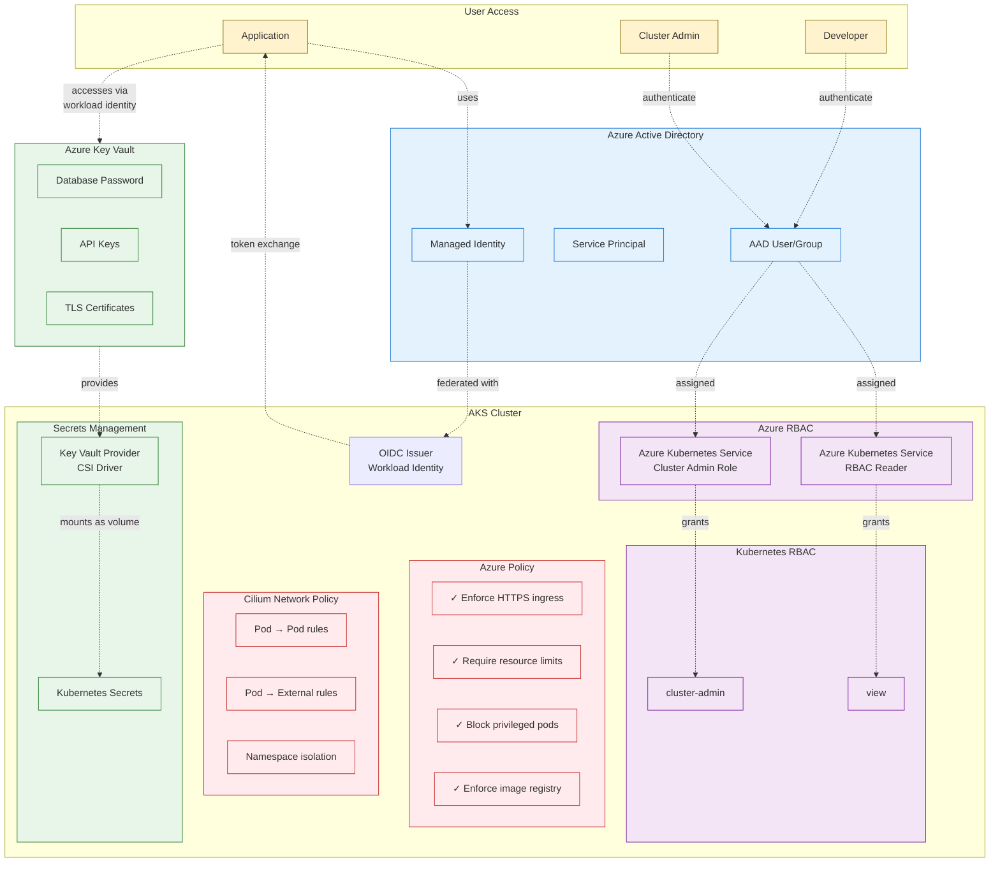
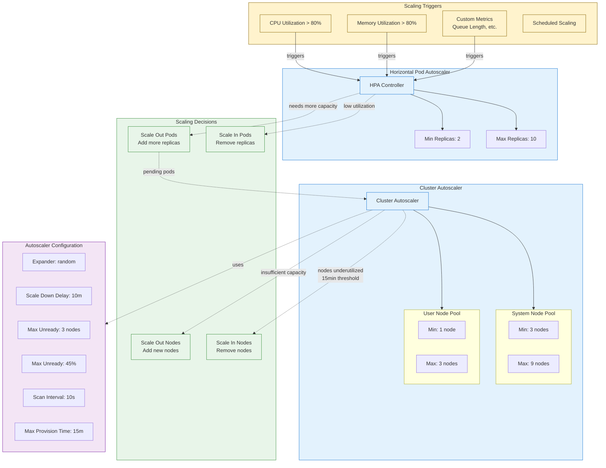
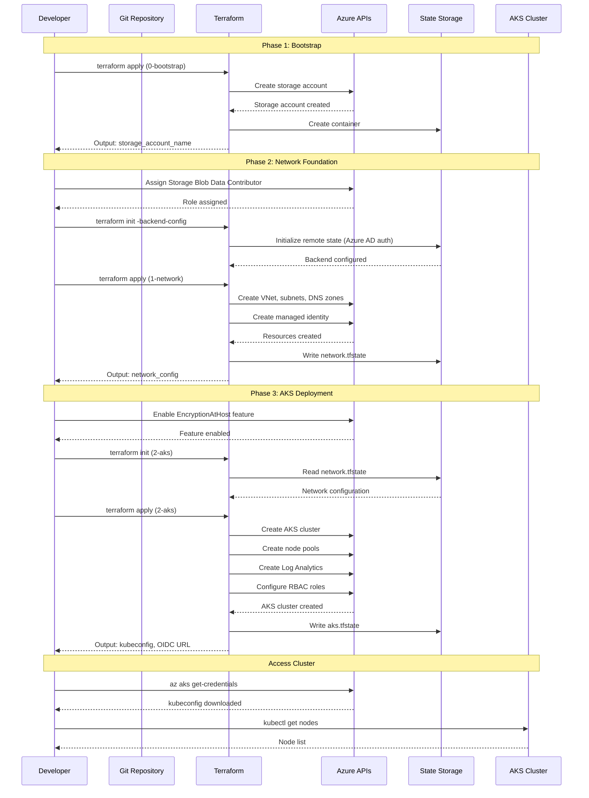
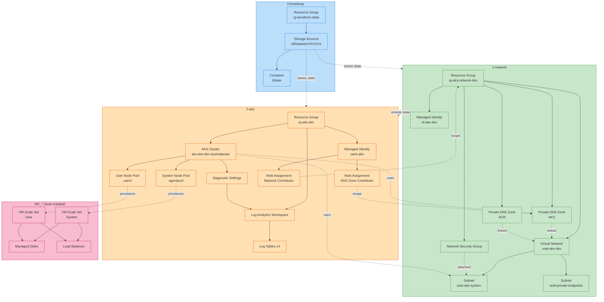

# AKS Architecture Diagram

## High-Level Architecture

```mermaid
graph TB
    subgraph Internet["Internet"]
        User[User/Developer]
        CI[CI/CD Pipeline]
    end
    
    subgraph AzureSubscription["Azure Subscription: 1ba93e37-9d55-40ca-b240-0435b633fc72"]
        
        subgraph StateStorage["Terraform State Storage"]
            RGState[Resource Group<br/>rg-terraform-state]
            SA[Storage Account<br/>sttfstatedevXXXXXX<br/>🔐 Azure AD Auth Only]
            Container[Container: tfstate]
            
            RGState --> SA --> Container
            
            subgraph StateFiles["State Files"]
                S1[network.tfstate]
                S2[aks.tfstate]
                S3[postgresql.tfstate]
            end
            Container --> StateFiles
        end
        
        subgraph NetworkRG["Resource Group: rg-aks-network-dev<br/>Location: Australia East"]
            VNet[Virtual Network<br/>vnet-aks-dev<br/>10.0.0.0/16]
            
            subgraph Subnets["Subnets"]
                SubnetAKS[AKS System Nodes<br/>snet-aks-system<br/>10.0.0.0/22<br/>1024 IPs]
                SubnetPE[Private Endpoints<br/>snet-private-endpoints<br/>10.0.4.0/24<br/>256 IPs]
            end
            
            subgraph DNS["Private DNS Zones"]
                DNSAKS[privatelink.australiaeast<br/>.azmk8s.io]
                DNSACR[privatelink.azurecr.io]
            end
            
            subgraph Identity["Managed Identities"]
                IDAKS[User Assigned Identity<br/>id-aks-dev]
            end
            
            NSG[Network Security Group<br/>aks-nsg]
            
            VNet --> Subnets
            VNet -.->|linked| DNS
            NSG -.->|attached| SubnetAKS
        end
        
        subgraph AKSRG["Resource Group: rg-aks-dev<br/>Location: Australia East"]
            
            subgraph AKSCluster["AKS Cluster: aks-aks-dev-australiaeast"]
                ControlPlane[Control Plane<br/>🔒 Private<br/>Kubernetes v1.31]
                
                subgraph SystemPool["System Node Pool: agentpool"]
                    SysNode1[Node 1<br/>Standard_D4d_v5<br/>Zone 2]
                    SysNode2[Node 2<br/>Standard_D4d_v5<br/>Zone 2]
                    SysNode3[Node 3<br/>Standard_D4d_v5<br/>Zone 2]
                end
                
                subgraph UserPool["User Node Pool: user2"]
                    UserNode1[Node 1<br/>Standard_D4d_v5<br/>Zone 2]
                end
                
                subgraph PodNetwork["Pod Network - CNI Overlay"]
                    PodCIDR[Pod CIDR<br/>10.244.0.0/16]
                    ServiceCIDR[Service CIDR<br/>10.245.0.0/16]
                    DNS[DNS: 10.245.0.10]
                end
                
                subgraph Security["Security & Identity"]
                    RBAC[Azure AD RBAC<br/>🔐 Enabled]
                    Policy[Azure Policy<br/>✅ Enabled]
                    WLIdentity[Workload Identity<br/>OIDC Issuer]
                    KV[Key Vault Secrets<br/>Provider]
                end
                
                ControlPlane --> SystemPool
                ControlPlane --> UserPool
            end
            
            subgraph Monitoring["Monitoring & Logging"]
                LAW[Log Analytics Workspace<br/>log-aks-dev-australiaeast-aks]
                Diag[Diagnostic Settings<br/>AllMetrics + Logs]
                
                subgraph Tables["Log Tables - Basic Plan"]
                    T1[AKSAudit - 30 days]
                    T2[AKSAuditAdmin - 30 days]
                    T3[AKSControlPlane - 30 days]
                    T4[ContainerLogV2 - 30 days]
                end
                
                LAW --> Tables
            end
            
            Identity2[User Assigned Identity<br/>uami-aks]
            
            AKSCluster --> LAW
            Identity2 -.->|assigned to| ControlPlane
        end
        
        subgraph NodeRG["Node Resource Group<br/>(Auto-created by AKS)"]
            VMSS1[VM Scale Set<br/>System Pool]
            VMSS2[VM Scale Set<br/>User Pool]
            Disks[Managed Disks<br/>OS + Data]
            LB[Load Balancer<br/>Standard]
            PIP[Public IP<br/>(if not private)]
        end
    end
    
    %% Connections
    User -.->|kubectl via<br/>Private Link| ControlPlane
    CI -.->|Azure DevOps Agent| ControlPlane
    
    SubnetAKS -.->|hosts| SystemPool
    SubnetAKS -.->|hosts| UserPool
    
    ControlPlane -.->|uses| DNSAKS
    
    AKSCluster -.->|network| SubnetAKS
    
    Identity2 -.->|Network Contributor| NetworkRG
    Identity2 -.->|DNS Zone Contributor| DNSAKS
    
    SystemPool --> VMSS1
    UserPool --> VMSS2
    
    %% Styling
    classDef azure fill:#0078d4,stroke:#005a9e,color:#fff
    classDef network fill:#7fba00,stroke:#5c8700,color:#fff
    classDef compute fill:#ff8c00,stroke:#cc7000,color:#fff
    classDef security fill:#e81123,stroke:#b00a1a,color:#fff
    classDef storage fill:#50e6ff,stroke:#00b7c3,color:#000
    classDef monitor fill:#ffb900,stroke:#cc9400,color:#000
    
    class AzureSubscription azure
    class NetworkRG,VNet,Subnets,DNS network
    class AKSRG,AKSCluster,SystemPool,UserPool,NodeRG compute
    class RBAC,Policy,WLIdentity,KV security
    class StateStorage,SA,Container storage
    class Monitoring,LAW,Tables monitor
```

---

## Network Architecture Detail



---

## Pod Networking - CNI Overlay



---

## Security Architecture



---

## Monitoring & Observability Architecture

```mermaid
graph TB
    subgraph AKS["AKS Cluster"]
        ControlPlane[Control Plane<br/>API Server, Scheduler, etc.]
        
        subgraph Nodes["Nodes"]
            Node1[Node 1]
            Node2[Node 2]
            
            subgraph Pods["Pods"]
                App1[Application Pod]
                App2[Application Pod]
            end
        end
        
        subgraph Agents["Monitoring Agents"]
            OMS[Container Insights<br/>OMS Agent]
            MetricsAgent[Azure Monitor<br/>Metrics Agent]
        end
    end
    
    subgraph Monitoring["Azure Monitor"]
        LAW[Log Analytics Workspace<br/>log-aks-dev-australiaeast-aks]
        
        subgraph Logs["Container Insights Logs"]
            ContainerLog[ContainerLogV2<br/>30 day retention<br/>Basic plan]
            PerfLog[Perf<br/>Performance metrics]
            InvLog[KubeNodeInventory<br/>Node inventory]
        end
        
        subgraph DiagLogs["AKS Diagnostic Logs"]
            APIServer[kube-apiserver<br/>API requests]
            Audit[kube-audit<br/>Audit events]
            AuditAdmin[kube-audit-admin<br/>Admin actions]
            ControlPlaneLog[AKSControlPlane<br/>Control plane logs]
            Autoscaler[cluster-autoscaler<br/>Scaling events]
            CloudController[cloud-controller-manager]
            CSIDisk[csi-azuredisk-controller]
            CSIFile[csi-azurefile-controller]
            Guard[guard<br/>Admission webhook]
            Scheduler[kube-scheduler]
        end
        
        subgraph Metrics["Azure Monitor Metrics"]
            NodeCPU[Node CPU %]
            NodeMem[Node Memory %]
            PodCount[Pod Count]
            DiskUsage[Disk Usage]
        end
    end
    
    subgraph Visualization["Visualization & Alerts"]
        Portal[Azure Portal<br/>Container Insights]
        Workbooks[Azure Workbooks<br/>Custom Dashboards]
        Alerts[Alert Rules<br/>Email/SMS/Webhook]
        Grafana[Grafana<br/>(Optional)]
    end
    
    %% Data Flow
    ControlPlane -->|diagnostic logs| DiagLogs
    Nodes -->|via OMS agent| Logs
    Pods -->|stdout/stderr| ContainerLog
    Nodes -->|metrics| Metrics
    
    Logs --> LAW
    DiagLogs --> LAW
    Metrics --> LAW
    
    LAW --> Portal
    LAW --> Workbooks
    LAW --> Alerts
    LAW -.->|export| Grafana
    
    %% Queries
    subgraph Queries["Sample Queries"]
        Q1["Failed Pods:<br/>ContainerLogV2<br/>| where ContainerStatus == 'Failed'"]
        Q2["High CPU Nodes:<br/>Perf<br/>| where CounterName == 'cpuUsagePercentage'<br/>| where CounterValue > 80"]
        Q3["API Server Errors:<br/>AKSControlPlane<br/>| where Category == 'kube-apiserver'<br/>| where Level == 'Error'"]
    end
    
    Portal -.->|run| Queries
    
    classDef aks fill:#0078d4,stroke:#005a9e,color:#fff
    classDef monitor fill:#ffb900,stroke:#cc9400,color:#000
    classDef logs fill:#e8f5e9,stroke:#388e3c
    classDef viz fill:#f3e5f5,stroke:#7b1fa2
    
    class AKS,ControlPlane,Nodes,Pods aks
    class Monitoring,LAW,Metrics monitor
    class Logs,DiagLogs,ContainerLog,APIServer,Audit logs
    class Visualization,Portal,Workbooks,Alerts,Grafana viz
```

---

## Auto-scaling Architecture



---

## Deployment Pipeline Architecture



---

## Resource Dependencies



---

## Summary

This architecture provides:

- **🔒 Security**: Private cluster, Azure AD RBAC, Azure Policy, Network Policy
- **📊 Observability**: Comprehensive logging to Log Analytics, Container Insights
- **⚡ Scalability**: Pod and node autoscaling with configurable thresholds
- **🛡️ Reliability**: Zone redundancy, HA configuration, health monitoring
- **🔐 Identity**: Workload Identity for pod-to-Azure authentication
- **📦 State Management**: Centralized Terraform state with Azure AD authentication
- **🌐 Networking**: CNI Overlay for efficient IP utilization, private DNS resolution
