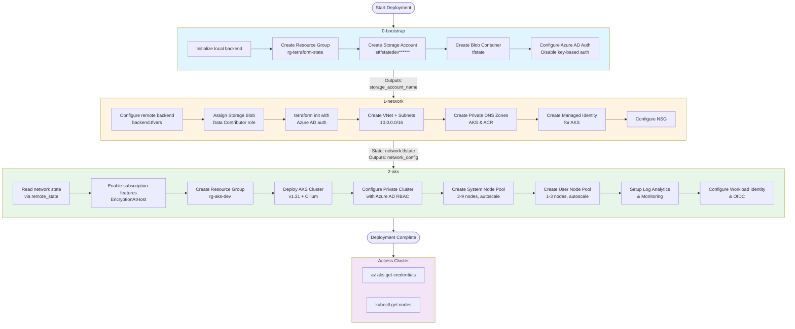
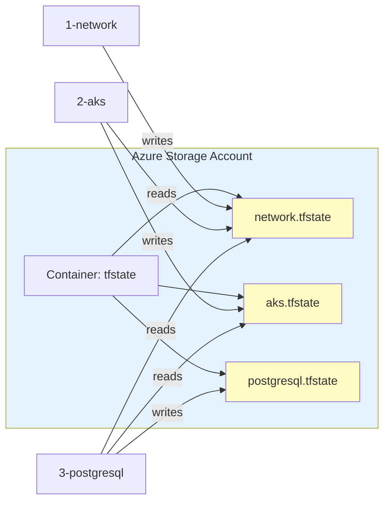
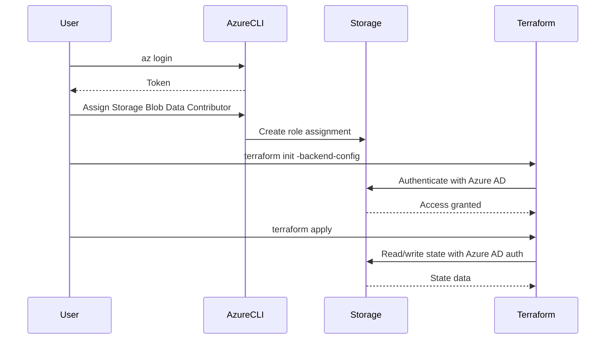
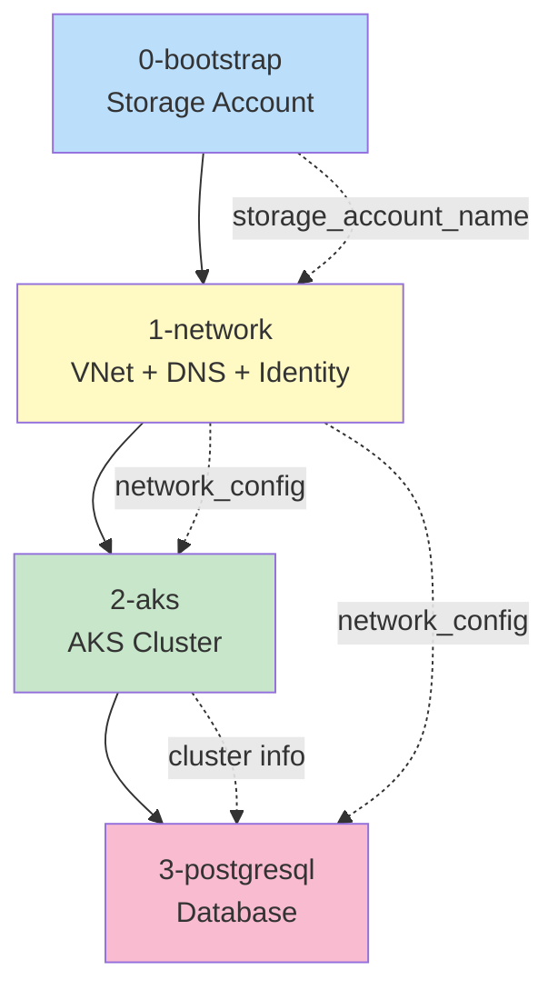
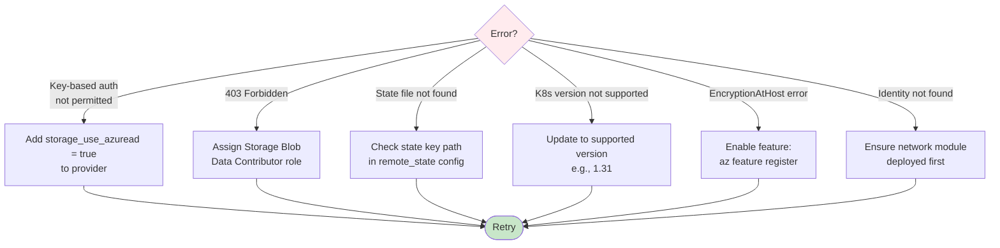

# AKS Deployment Flow

## Overview
This repository deploys a production-ready Azure Kubernetes Service (AKS) cluster using a modular, sequential approach with Terraform remote state management.

---

## Deployment Flowchart



---

## Detailed Step-by-Step Flow

### Phase 1: Bootstrap (0-bootstrap)
**Purpose**: Create remote state storage for all modules

```bash
cd 0-bootstrap
terraform init                    # Local backend
terraform apply -var environment=dev
```

**Creates**:
- Resource Group: `rg-terraform-state`
- Storage Account: `sttfstatedevXXXXXX` (random suffix)
- Container: `tfstate`
- Azure AD authentication enabled (key-based auth disabled)

**Outputs**:
- `storage_account_name` → Used by all subsequent modules

---

### Phase 2: Network Foundation (1-network)
**Purpose**: Create network infrastructure and prerequisites

```bash
cd ../1-network

# 1. Create backend config
cat > ../environments/dev/backend.tfvars <<EOF
resource_group_name  = "rg-terraform-state"
storage_account_name = "sttfstatedevXXXXXX"
container_name       = "tfstate"
key                  = "network.tfstate"
use_azuread_auth     = true
EOF

# 2. Assign storage permissions
az role assignment create \
  --role "Storage Blob Data Contributor" \
  --assignee $(az ad signed-in-user show --query id -o tsv) \
  --scope "/subscriptions/.../storageAccounts/sttfstatedevXXXXXX"

# 3. Initialize with remote backend
terraform init -backend-config="../environments/dev/backend.tfvars"

# 4. Deploy network infrastructure
terraform apply -var-file="../environments/dev/network.tfvars"
```

**Creates**:
- Resource Group: `rg-aks-network-dev`
- Virtual Network: `vnet-aks-dev` (10.0.0.0/16)
- Subnets:
  - `snet-aks-system` (10.0.0.0/22)
  - `snet-private-endpoints` (10.0.4.0/24)
- Private DNS Zones:
  - `privatelink.australiaeast.azmk8s.io`
  - `privatelink.azurecr.io`
- Managed Identity: `id-aks-dev`
- Network Security Group (optional)

**State File**: `tfstate/network.tfstate`

**Outputs** → `network_config`:
- VNet ID, Subnet IDs
- Private DNS Zone IDs
- Managed Identity ID

---

### Phase 3: AKS Deployment (2-aks)
**Purpose**: Deploy production AKS cluster using Azure Verified Modules

```bash
cd ../2-aks

# 1. Enable required features
az feature register --namespace Microsoft.Compute --name EncryptionAtHost
az provider register -n Microsoft.Compute

# 2. Initialize (shares same backend as network)
terraform init

# 3. Deploy AKS
terraform apply -var-file="../environments/dev/aks.tfvars"
```

**Reads Remote State**:
- `network.tfstate` → Gets VNet, subnets, DNS zones, identity

**Creates**:
- Resource Group: `rg-aks-dev`
- AKS Cluster: `aks-aks-dev-australiaeast`
  - Kubernetes: v1.31
  - Network Policy: Cilium
  - CNI: Azure Overlay (pods: 10.244.0.0/16)
  - Service CIDR: 10.245.0.0/16
- Node Pools:
  - System: 3-9 nodes, Standard_D4d_v5
  - User: 1-3 nodes, Standard_D4d_v5
- User-Assigned Identity: `uami-aks`
- Log Analytics Workspace
- Diagnostic Settings
- Role Assignments:
  - Network Contributor on network RG
  - Private DNS Zone Contributor

**State File**: `tfstate/aks.tfstate` (separate from network)

**Outputs**:
- `cluster_id`, `cluster_fqdn`
- `kube_config_raw`
- `oidc_issuer_url`

---

## State Management Flow



---

## Authentication Flow



---

## Configuration Files Structure

```
aksavm/
├── 0-bootstrap/
│   ├── main.tf              # Bootstrap resources
│   ├── variables.tf         # Environment variable
│   └── terraform.tfstate    # LOCAL state only
│
├── 1-network/
│   ├── main.tf              # Network resources + AVM module
│   ├── variables.tf         # Network configuration
│   ├── versions.tf          # Backend: azurerm (remote)
│   └── outputs.tf           # network_config output
│
├── 2-aks/
│   ├── main.tf              # AKS + remote state data source
│   ├── variables.tf         # AKS configuration
│   ├── versions.tf          # Backend: azurerm (remote)
│   ├── locals.tf            # Azure client config
│   └── outputs.tf           # Cluster outputs
│
└── environments/
    └── dev/
        ├── backend.tfvars   # Shared backend config
        ├── network.tfvars   # Network variables
        └── aks.tfvars       # AKS variables
```

---

## Key Dependencies



---

## Variables Flow

### Bootstrap → Network
```
backend_config (from bootstrap output)
  ↓
environments/dev/backend.tfvars
  ↓
terraform init -backend-config
```

### Network → AKS
```
network.tfstate (remote state)
  ↓
data.terraform_remote_state.network
  ↓
outputs.network_config {
  subnet_aks_system_id
  private_dns_zone_aks_id
  identity_id
}
  ↓
module.aks_cluster inputs
```

---

## Troubleshooting Flow



---

## Summary

1. **Bootstrap**: Creates shared remote state storage (run once)
2. **Network**: Creates foundation infrastructure, stores state remotely
3. **AKS**: Reads network state, deploys cluster
4. **Access**: Use Azure CLI to get kubeconfig and access cluster

All modules use Azure AD authentication for state storage (no access keys needed).
